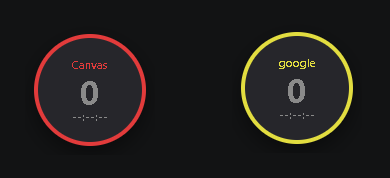
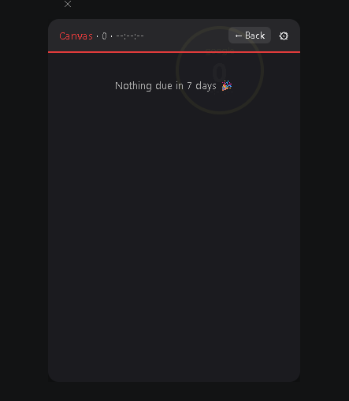
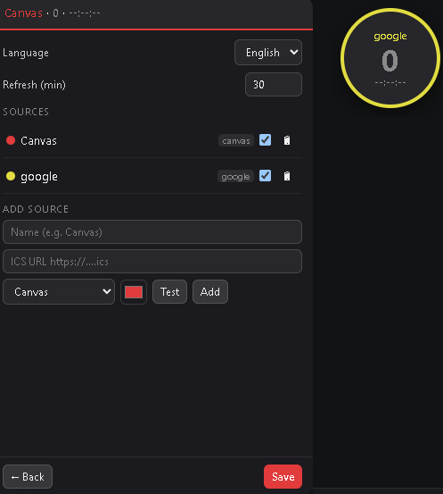

# Canvas Deadline Ball 🔴

[English](README.md) · **简体中文**

常驻桌面、永远置顶的悬浮球,显示你 **Canvas** / **Google 日历** / 任意 **ICS** 日历源里即将到期的作业 —— 每个源一个球,带实时倒计时 —— 不用打开任何东西,扫一眼桌面就知道要交什么。

<p align="center">
  <br />
  
  
</p>

## 为什么做它

Canvas 挺好,但你得**主动去看**。这个东西直接活在你桌面上:每个日历一个小球,显示未来 7 天有几个要交、以及到最近一个 ddl 的实时倒计时。点一下展开列表,点某条打开它,做完了打个勾划掉。

## 功能

- 🔴 **每个源一个**无边框/透明/置顶/可拖的悬浮球(Canvas / Google 日历 / 任意 ICS)
- ⏱️ 到最近 ddl 的**实时倒计时**,按紧急度变色(绿 → 黄 → 红)
- 📋 点击展开未来 7 天列表;点某条用浏览器打开
- ✅ **标记完成** —— 打勾后它从计数里消失
- 🔄 **Canvas 自动完成(beta)** —— 登录一次 Canvas,已提交的作业会被自动检测并打勾(见配置)
- ⚙️ 可视化设置 —— 增删源、选颜色、中英切换;定时自动刷新
- 🪶 轻量 —— 基于 [Tauri](https://tauri.app)(Rust + 系统 WebView),不是 Electron

## 配置

1. **拿一条日历订阅(ICS)链接。**
   - **Canvas**:*Calendar(日历)→ Calendar Feed*(右下角)→ 复制那条 `.ics`。
   - **Google 日历**:*设置和共享 → 集成日历 → iCal 格式的私密地址*。
   > ⚠️ 把链接当密码看待 —— 拿到的人就能看你日历,泄了可以重置。
2. **在 App 里加**:点球 → ⚙ 设置 → 粘链接、选类型(Canvas / Google / 通用 ICS)和颜色 → **测试** → **添加** → **保存**,就会出现一个对应的球。
3. *(可选)* **Canvas 自动完成**:在设置里**登录一次 Canvas**。之后 App 会用你的登录态调 Canvas API 读出已提交的作业、自动打勾。**很多学校(比如 UMich)不让你生成 API token,但通过网页登录认证照样能拿到信息** —— 就像校园 VPN 登录那样。
   > **登的是哪个 Canvas?** 你自己学校的。那个网址是**自动从你的 Canvas ICS 链接里取的**,所以永远指向你本校,没有任何写死的域名。换个学校 = 换条 ICS = 自动跟着变。不想配 ICS、或者你学校的 Canvas 在另一个域名上?直接在设置的 **Canvas 网址**框里填,比如 `https://你的学校.instructure.com`。
   >
   > *仅对 Canvas 有效,其它日历仍是手动打勾。*

## 从源码构建

**前置:** [Rust](https://rustup.rs)(Windows 用 MSVC 工具链)和 [Node.js](https://nodejs.org)。

```bash
npm install
npm run tauri dev      # 开发运行
npm run tauri build    # 打包 release 安装包
```

> 内存小的 Windows 机器首次构建可能 OOM(Tauri 依赖树大)。OOM 就单线程:在 `src-tauri/` 里跑 `cargo build -j 1`。

## 工作原理

- **后端(Rust,`src-tauri/`)** —— 拉每个 ICS 源(`minreq`,原生 TLS),解析(`ical`),转本地时区(`chrono`),过滤未来 7 天,按源聚合。自动完成:开一个隐藏的 Canvas 登录 webview,读会话 cookie,调 Canvas planner API 找出已提交的作业。
- **前端(原生 HTML/CSS/JS,`src/`)** —— 每个源一个窗口:球、展开卡片、设置面板、倒计时,以及手动区分拖动 vs 点击。

## 已知局限

- feed 里没有具体时间的作业,默认按**本地时间 23:59** 算。
- ICS 源按提供方自己的节奏更新,不是严格实时。
- 自动完成**仅 Canvas**、需登录一次(会话会保留);其它源是手动打勾。
- **多个 Canvas 学校:** 自动完成一次只对准一个 Canvas,且"已完成"是按 Canvas 的 assignment id 对账的 —— 这个 id 只在**同一所学校内**唯一。同时挂两所学校时偶尔可能串台;单所学校完全没问题。
- 目前只支持 Windows(Tauri 应用,以后可扩到 macOS/Linux)。

## 技术栈

Tauri v2 · Rust · 原生 JS · Canvas ICS 源 + planner API

## 反馈 / Issues

碰到 bug、配置卡住,或者想要 **macOS / Linux** 版、想加某个还不支持的日历源?**欢迎来提 [issue](../../issues)** —— 使用上的问题、"求支持 XX 平台"的期待都很欢迎。这是个人小项目,大家提什么,接下来多半就做什么。

---

一个顺手给自己做的小玩意 —— 纪念我这学期漏掉、而且不让补做的 quiz 1。🥲
